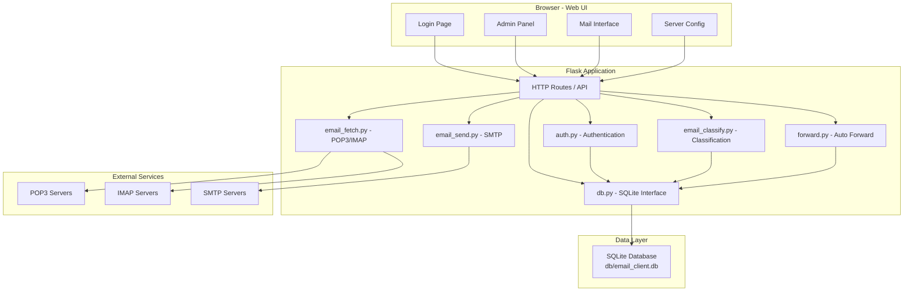
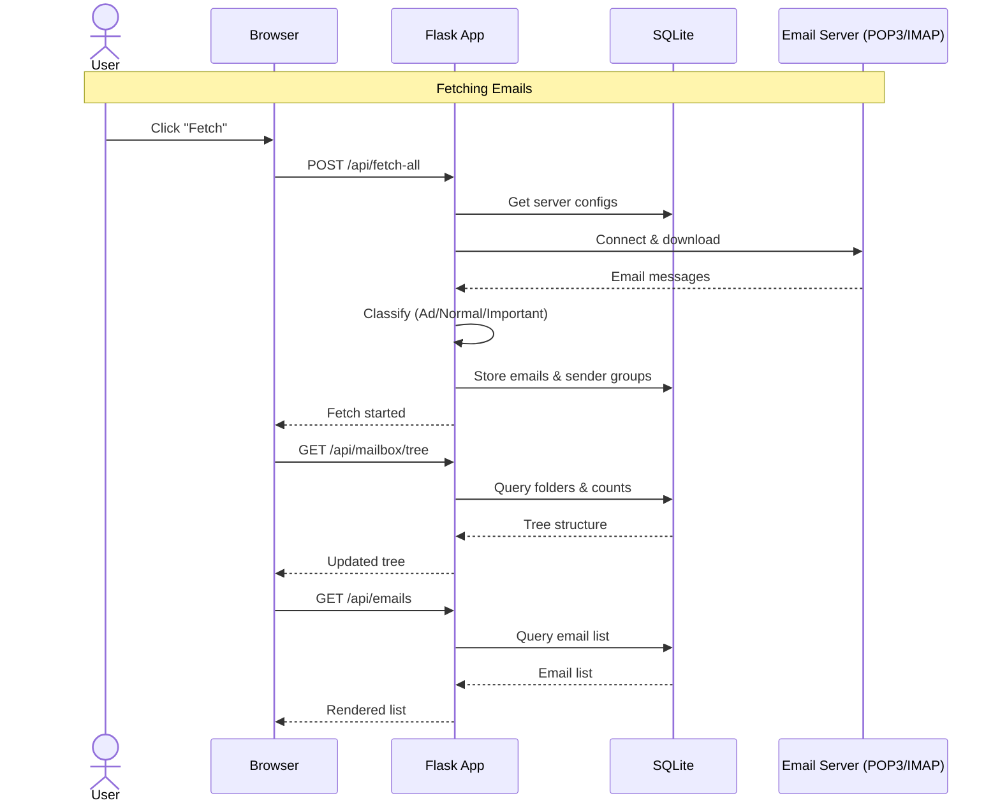

# Email Client - Architecture Design

## Overview

A web-based email client running on Ubuntu with Python Flask backend and SQLite storage. Supports multiple email accounts per user, automatic email classification, sender grouping, and auto-forwarding.

## System Architecture



## Directory Structure

```
email-client/
├── app.py                  # Main Flask application with all routes
├── config.py               # Application configuration
├── requirements.txt        # Python dependencies
├── modules/
│   ├── __init__.py         # DB connection, schema initialization
│   ├── auth.py             # User authentication and management
│   ├── email_fetch.py      # POP3/IMAP email fetching
│   ├── email_send.py       # SMTP email sending
│   ├── email_classify.py   # Ad detection and importance classification
│   └── forward.py          # Auto-forwarding rules engine
├── db/
│   └── email_client.db     # SQLite database (auto-created)
├── web/
│   ├── templates/
│   │   ├── login.html      # Login page
│   │   ├── admin.html      # Admin panel (user management)
│   │   ├── mail.html       # Main mail interface
│   │   └── config.html     # Server configuration page
│   └── static/
│       ├── css/
│       │   ├── main.css    # Global styles
│       │   ├── login.css   # Login-specific styles
│       │   └── mail.css    # Mail interface styles
│       └── js/
│           ├── auth.js     # Authentication logic
│           ├── admin.js    # Admin panel logic
│           ├── mail.js     # Main mail interface logic
│           └── config.js   # Configuration logic
├── doc/
│   ├── architecture.md     # This document
│   ├── api.md              # API documentation
│   └── database.md         # Database schema
└── README.md
```

## Request Flow



## UI Layout

```
+----------------------------------------------------------+
|  Toolbar: [Compose] [Fetch]    Email Client    [Config] [Logout] |
+-------------------+--------------------------------------+
|                   |                                      |
|  Tree Menu       |  Email List / Detail / Compose       |
|                   |                                      |
|  Inbox            |  +------------------------------+   |
|  +-- Important    |  | From: sender@example.com     |   |
|  |  +-- sender1   |  | Subject: Meeting tomorrow    |   |
|  |  +-- sender2   |  | Date: 2026-06-23 14:30      |   |
|  +-- Normal       |  | [badge: Gmail]               |   |
|  |  +-- sender3   |  +------------------------------+   |
|  +-- Ad           |  | Dear team, ...               |   |
|  |  +-- sender5   |  |                              |   |
|  Outbox           |  |                              |   |
|  Drafts           |  +------------------------------+   |
|  Deleted          |                                      |
|                   |                                      |
+-------------------+--------------------------------------+
```

## Key Design Decisions

1. **Flask over Django**: Lightweight, sufficient for this use case
2. **SQLite**: Zero-config, file-based, sufficient for single-user/multi-user desktop deployment
3. **Threaded fetch**: Email fetching runs in background threads to avoid HTTP timeout
4. **Keyword-based classification**: Rule-based ad detection (no ML dependency), extensible
5. **Protocol support**: Both POP3 and IMAP with SSL/TLS
6. **Vanilla JS frontend**: No framework dependency, single-file modules per concern
