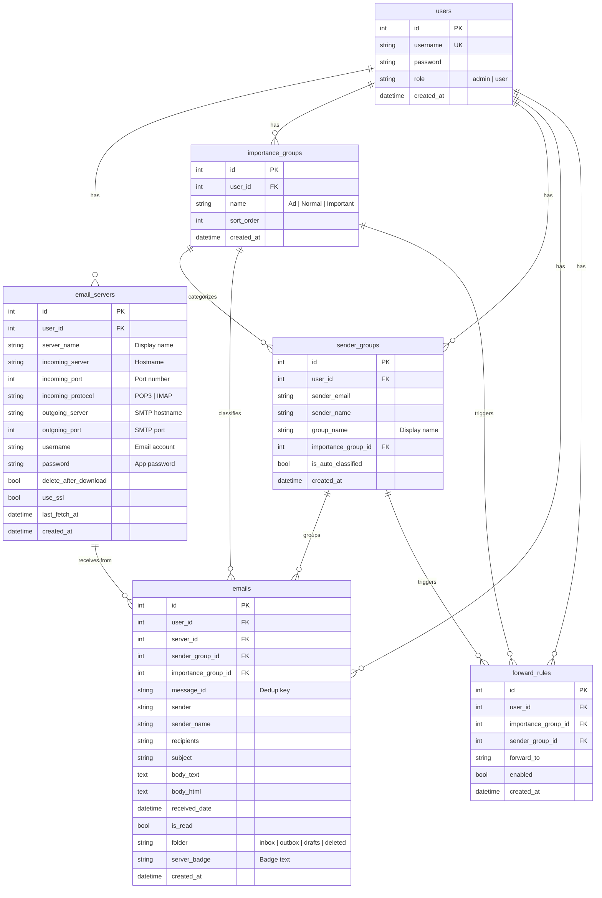

# Database Schema

## Entity Relationship Diagram

## Table Descriptions

### users
Stores user accounts. The first user created is `admin` with role `admin`. Admin can create/delete regular users (role `user`).

### email_servers
Each user can configure multiple email servers. Supports both POP3 and IMAP for incoming, SMTP for outgoing (optional). Passwords are stored as plaintext for SMTP/POP3 authentication (standard practice for local email clients).

### importance_groups
Three default groups created for each new user: `Ad` (sort_order=0), `Normal` (sort_order=1), `Important` (sort_order=2). Users cannot delete these.

### sender_groups
Auto-created when a new sender is encountered during email fetch. Each sender group belongs to an importance group. Users can manually reassign importance.

### emails
The core table storing all email messages across all folders. The `message_id` field is used for deduplication when fetching from the same server multiple times. The `folder` field determines which mailbox view the email appears in.

### forward_rules
Rules for auto-forwarding. A rule can target either an importance group (all emails in that category) or a specific sender group. Multiple rules can coexist.

## Indexes

- `idx_emails_user_folder` - Fast lookup of emails by user and folder
- `idx_emails_user_sender` - Fast grouping by sender
- `idx_emails_message_id` - Deduplication check
- `idx_sender_groups_user` - Per-user sender group lookup
- `idx_forward_rules_user` - Per-user forward rule lookup
